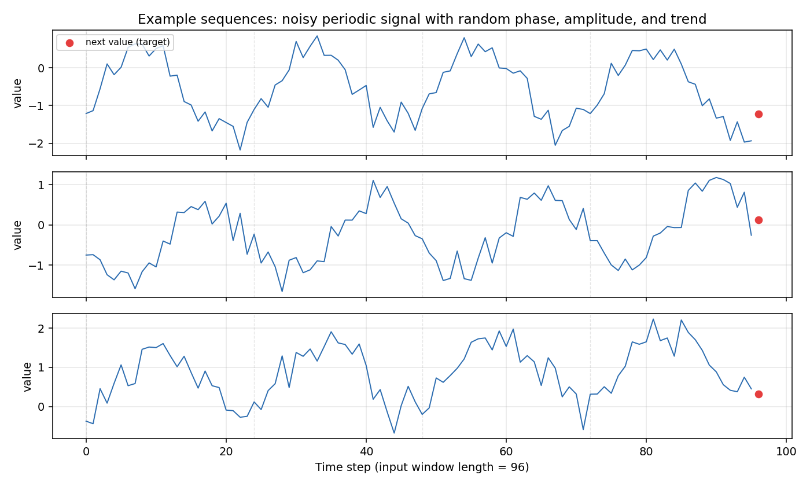
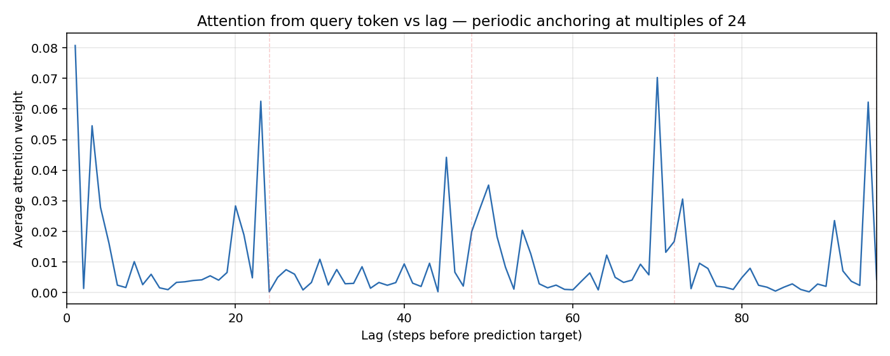
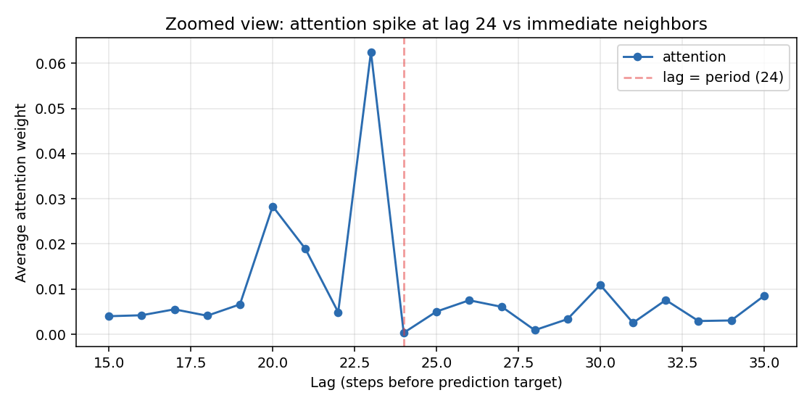
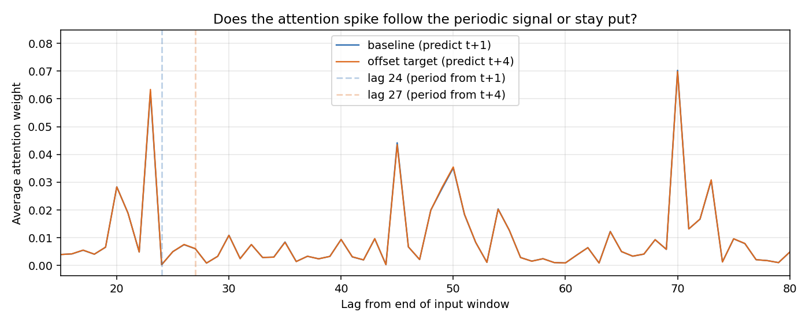
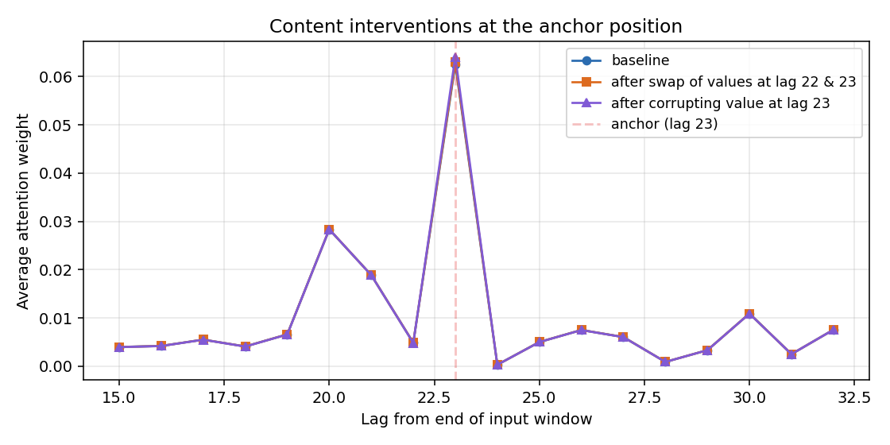

When a transformer is trained on data with a periodic structure, its attention patterns frequently exhibit sharp spikes at integer multiples of the period — 24 steps, 48 steps, 72 steps. The conventional interpretation is that the model has learned the underlying periodicity of the data and is actively retrieving relevant past events.

However, an alternative mechanism is possible: the model may have developed a fixed *positional* routine, learning to attend to specific slots regardless of their actual content. In this scenario, periodic spikes do not indicate that specific historical events are uniquely informative; instead, they function as an internal indexing scheme that happens to match the data's period.

These two hypotheses imply very different things about what attention weights actually represent. In production environments, such as recommendation systems, distinguishing between them is difficult because you cannot manipulate the data stream without retraining, and the true importance of individual features is often unknown. To isolate these mechanisms, we can evaluate a transformer in a fully controlled, synthetic environment.

## The setup

We train a small transformer (≈29k parameters, 2 layers, 1 attention head) to predict the next value of a noisy periodic signal:

$$y_t = \text{intercept} + \text{slope} \cdot t + A \sin(2\pi t / 24 + \phi) + \varepsilon_t$$

The amplitude, phase, slope, and additive noise are randomized across sequences. The model receives the past 96 values (corresponding to 4 full periods) as input and predicts the immediate next value.

{#fig-data}

This task has a straightforward optimal solution. To predict the next step, the model must estimate the trend and the phase of the sine wave. Because the underlying sine wave is smooth, adjacent points carry nearly identical phase information. Consequently, there is no intrinsic mathematical reason why an input exactly 24 steps ago should be significantly more informative than one 23 steps ago.

A learnable query token is appended to the sequence, and the prediction is read exclusively from this position, mimicking a LLaTTE-style readout bottleneck. After 6 epochs of training, the model achieves a validation MSE of 0.117. This is close to the irreducible noise floor (~0.09) and well below the baseline performance of simply predicting the last observed value (0.210).

## What the attention pattern looks like

We extract the attention weights from the query token to each input position, average them across both layers, and evaluate the mean profile across 1,000 held-out validation sequences:

{#fig-baseline}

The resulting profile shows clear, recurring spikes spaced roughly one period apart, alongside a strong recency bias near lag 1. This matches the expected pattern, but two specific details warrant closer inspection before running interventions:

1. **The anchors deviate slightly from the true period.** The peaks occur at lags of 23, 45, and 69, rather than 24, 48, and 72. This discrepancy suggests the model is not simply transcribing the data's period. A likely explanation is that causal attention favors looking further into the past; lag 23 provides nearly identical phase information to lag 24 but extends one step deeper into the history. This indicates the spike locations are a learned structural artifact rather than a direct reflection of the data structure.

2. **Lag 23 receives roughly 13× more attention than lag 22.** A zoom-in:

{#fig-zoom}

Despite these two adjacent positions holding nearly identical content, their attention weights differ by an order of magnitude. We can exploit this variance to test the model's behavior.

At this stage, the observations are compatible with both hypotheses: the model might attend to lag 23 because it associates that relative position with predictive utility, or it might be executing a rigid positional heuristic.

## Intervention 1: shift the period, watch the attention

If the model dynamically tracks the periodic signal within the data, shifting the alignment of the period should cause the attention spikes to shift accordingly. To test this, we generate sequences where the prediction target is positioned 4 steps after the input window (rather than 1 step after, as seen during training). This shifts the optimal lookback point from lag 24 to lag 21 relative to the end of the input window. If the model is content-driven, the spike should move to lag 21. If it relies on fixed positions, the spike should remain stationary.

{#fig-offset}

The baseline and offset attention curves overlap entirely, showing identical values to roughly three decimal places at every lag. The attention distribution is completely unresponsive to changes in where the period actually aligns relative to the target.

As a consequence of this rigidity, the prediction MSE degrades from 0.117 to 0.403—a 3.4× increase in error. The model incurs a substantial performance penalty because it cannot adapt its attention spikes to the new alignment. This result rules out the hypothesis that the attention pattern dynamically tracks the signal's period.

## Intervention 2: swap the contents

Even if the model uses a fixed positional routine, it might still treat the value at that specific anchor position as the primary informative feature. We can test whether the model is sensitive to the content of the anchor slot by manipulating the values at lags 22 and 23. Because the autocorrelation between adjacent points in a sine wave with a period of 24 is high (~0.97), these slots contain very similar signal profiles. We perform two distinct interventions:

- **Swap.** Exchange the values at lag 22 and lag 23. Position 23 now contains the value originally at position 22, and vice versa. If the attention mechanism targets the underlying content, the peak weight should shift to position 22.
- **Corrupt.** Replace the value at lag 23 with random Gaussian noise. If attention depends on feature relevance, the weight at this position should drop significantly.

{#fig-swap}

All three interventions yield identical attention profiles down to the third decimal place:

| Position | Baseline attention | After swap | After corruption |
|---|---|---|---|
| Lag 23 (anchor) | 0.0625 | 0.0630 | 0.0641 |
| Lag 22 (neighbor) | 0.0049 | 0.0049 | — |

: Attention weights at the anchor position and its neighbor under each intervention. {#tbl-attn}

Notably, attention at the anchor position increases slightly after corruption. The model fails to redirect attention away from the degraded slot; instead, it enforces its positional routine regardless of data quality.

The impact on prediction error reflects this rigidity:

| Condition | MSE | Δ from baseline |
|---|---|---|
| Baseline | 0.1168 | — |
| Value swap at lag 22 / 23 | 0.1173 | +0.0005 |
| Corruption of lag-23 value | 0.1428 | +0.0260 |

: Prediction MSE under each intervention. The model cannot route around a broken anchor. {#tbl-mse}

The swap causes negligible harm because the exchanged values are highly correlated and read through the same structural anchor. However, corrupting lag 23 noticeably increases the error. Because the model continues to attend heavily to the corrupted slot, it incorporates pure noise into its final prediction, demonstrating an inability to route around a broken anchor.

## What this shows, and what it doesn't

In this synthetic environment, the model strictly exhibits positional anchoring rather than content-driven retrieval. The findings are supported by several points:

- The attention spikes do not align with the true physical period of the data (lag 23 vs. lag 24).
- The spikes remain fixed when the underlying period of the data shifts.
- The attention weights do not change when the contents of the target positions are swapped or replaced with noise.
- The model accepts a significant increase in prediction error rather than shifting its attention weights.

However, these findings come with specific caveats:

1. **This does not disprove content-driven attention in production systems.** Real-world user behavior contains actual periodic routines — people do click ads at the same time of day. Models trained on complex data likely combine positional anchoring with genuine content-driven features. The experiment demonstrates that anchoring can emerge purely from positional cues, but it does not measure the balance between anchoring and content selection in large-scale models.

2. **The synthetic dataset is simpler than real-world data.** A signal defined by a single dominant frequency and Gaussian noise makes a fixed "anchor and reconstruct" strategy highly cost-effective. Real-world sequences feature irregular spacing, multiple overlapping time horizons, and heterogeneous content, which changes the trade-offs and likely reduces the severity of pure anchoring.

3. **The scope is limited to a single model instance.** We did not perform a broad sweep of architectures or initialization seeds. While the presence of positional anchors was robust enough to appear clearly on the first run, the exact lag of the spikes should be viewed as an implementation detail of this specific training instance.

4. **The anchoring behavior dictates downstream performance.** Corrupting the anchor directly degrades the final MSE because the model cannot adjust. This highlights why interpreting attention weights as a proxy for "feature importance" can be misleading: the model treats the slot as important even when its contents are demonstrably harmful to the prediction.

## The takeaway

I find this useful as a calibration. The next time someone shows me an attention plot with sharp periodic spikes and a story about temporal patterns, I'll want to know: did anyone test whether the spikes move when the periodic alignment moves? Did anyone swap the contents of the spike positions? If not, the plot is consistent with the model having learned a clever indexing scheme that has nothing to do with the temporal narrative.

It's also a reminder that interpretability is hard in a specific way. The attention pattern isn't telling us what the model thinks; it's telling us what the model *does*. Translating from "does" to "thinks" requires interventions, and in this small example the two come out genuinely different.