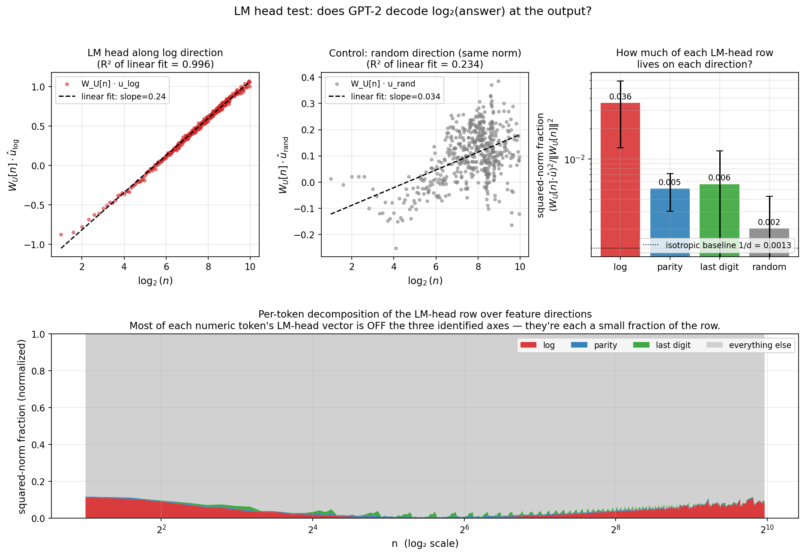

## The question

For three centuries prior to the advent of digital calculators, scientific multiplication relied heavily on slide rules. The physical slide rule maps arithmetic computation onto a foundational geometric identity:

$$
a \\cdot b = 2^{\\log_2 a + \\log_2 b}
$$ {#eq-shortcut}

By computing spatial additions across logarithmic spaces, this layout trades complex multi-digit multiplication for three simple lookups and a single addition. Distances on a slide rule are spaced by $\\log_2(x)$ rather than linear magnitude, meaning that the physical transposition of parts mechanically performs exponential scaling.

Whether an artificial neural network scales numerical features along an identical internal geometry remains an open question. When exposed to text containing frequent numerical patterns, does a standard transformer develop an internal representation analogous to a slide rule?

While a comprehensive mechanistic investigation would involve training custom architectures from scratch under explicit capacity constraints, this evaluation targets a more direct question: **is a log-multiplication shortcut already present within existing small pre-trained language models?**

To trace this behavior, I evaluated GPT-2 small (124M parameters) and Pythia-160M. The evaluation relies on two primary interpretability paradigms: **linear probing** to read localized semantic features directly from the residual stream, and **activation patching** to test the downstream causal impact of surgically modifying vector coordinates along targeted directions.

::: {.callout-note title=\"Summary in one figure\"}
![Six panels covering three models (GPT-2 small / Pythia-70M / Pythia-160M). **A:** Embedding log-axis decodability in all three. Log dominates only under weight tying; untied Pythia models prefer linear by a hair. **B:** GPT-2 *does* compute $\\log_2(a \\cdot b)$ at the equals-sign at $R^2 = 0.989$ — but on a different axis than the one used to read the operands. **C:** New result. Patching along that fresh answer-side direction moves the LM head's argmax with slope only $0.07$ — the probe is correlational, not causal. **D:** LM-head log-axis fraction collapses to baseline once weights are untied, so GPT-2's \"28× baseline\" was mostly architectural. **E:** Near-miss slope $\\beta$ is invariant at ~0.22 across all three models, even as panels A and D vary by orders of magnitude. **F:** synthesis.](./summary_figure.png){#fig-summary}
:::

## A simple model first: when *should* a learner discover the shortcut?

To understand the optimization trade-offs, I first formulated a toy mathematical routing model to quantify cost pressures. Consider two independent computational pathways to solve for $z = a \\cdot b$:

- **Direct multiplication:** This path scales with numerical complexity, carrying an algorithmic cost of $c_{\\mathrm{mul}}(a, b) = \\log_2(a) \\cdot \\log_2(b)$. Simpler calculations (e.g., small single-digit values) require minimal bit manipulation, whereas macro-integers scale heavily.
- **Log–sum–exp shortcut:** This path operates via fixed lookups with a static complexity baseline of $c_{\\mathrm{short}} = 6$, remaining uniform regardless of operand magnitude.

We can define a learnable gating parameter $p \\in [0, 1]$ that observes $(\\log_2 a, \\log_2 b)$ to optimize path routing. Given a specific multiplication complexity penalty $\\lambda$, the expected total cost is defined as:

$$
C(p, a, b, \\lambda) = (1-p)\\cdot \\lambda \\cdot c_{\\mathrm{mul}}(a, b) + p \\cdot c_{\\mathrm{short}}.
$$ {#eq-cost}

Sweeping across values of $\\lambda$ traces a clear optimization boundary. Complex operand pairs switch to the fixed-cost shortcut early, whereas simple pairs resist routing changes. For trivial values involving $1$, direct calculation remains free because $\\log_2(1) = 0$, completely bypassing the need for a shortcut.

![Toy soft-routing model under varying multiplication-penalty weight $\\lambda$. **Top:** average shortcut probability across $(a, b) \\in [1, 64]^2$. The trained gate matches the analytical softmin to three decimal places. **Bottom:** per-pair gate at five snapshot $\\lambda$ values; the decision boundary sweeps from upper-right (hard pairs) to lower-left (easy pairs) as the penalty grows.](./reasoning_path_vs_penalty.png){#fig-toy-routing}

Rather than acting as an empirical result, this model serves as a quantitative baseline. It provides a geometric hypothesis to compare against when testing whether real, text-trained models show any underlying trace of this efficiency-driven routing.

## How GPT-2 represents numbers

To investigate how a model processes integer values internally, we can query the residual stream at a specific numerical token position. If a linear regression probe can accurately recover $\\log_2(x)$ from these hidden states, it indicates that the model isolates a distinct logarithmic vector direction within that layer.

I passed integer sequences from 2 to 1023 into GPT-2 small as isolated space-prefixed tokens (`\" 5\"`, `\" 17\"`, `\" 1024\"`). At each transformer block, the hidden states were extracted to train a ridge regression probe targeted at tracking $\\log_2(x)$ along with several operational controls.

**At the raw token embedding layer (layer 0)—prior to any attention or MLP processing—$\\log_2(x)$ is cleanly decodable with a cross-validated $R^2 = 0.95$.** Direct linear scaling ($x$) is significantly less distinct, yielding an $R^2 = 0.77$, while randomized control labels drop completely to $R^2 \\approx 0$. This confirms a clear embedding preference for logarithmic geometry.

To verify whether this axis represents a precise logarithmic scale rather than a generic monotonic trend, I evaluated a parametric family of power-law transformations ($x^\\alpha$). Probing performance peaks narrowly at $\\alpha = 0$, which corresponds mathematically to the logarithmic limit. Had the embedding prioritized linear magnitude, performance would have instead centered at \\alpha = 1.

The embedding layer also natively encodes several non-linear attributes. Vector directions for numerical parity achieve a decodability of $R^2 = 0.94$, and the final digit ($x \\bmod 10$) reaches an $R^2 = 0.92$. GPT-2 uncovers surface-level linguistic associations (e.g., clustering terms ending in `5`), yet remains entirely insensitive to deeper number-theoretic features like primality or divisibility by $7$, which fail to emerge above chance levels.

{#fig-controls}

### Does this generalise across categories of numbers?

We can test whether this logarithmic vector space acts as a universal magnitude axis that extends uniformly across diverse numeric formats, such as calendar years (`\" 1990\"`), round numbers (`\" 1000\"`), or spelled-out words (`\" million\"`).

The empirical data rejects this hypothesis. Applying the probe trained strictly on standard integers across these secondary groups yields highly degraded transfer metrics:

- **Calendar Years** (152 single-token years between 1500 and 2099): $R^2 = -2274$. The probe yields near-constant values, completely failing to separate the relative scale of distinct years.
- **Round Multiples** (33 single-token multiples of 100 up to 100,000): $R^2 = 0.22$, showing highly fragmented tracking.
- **Spelled Numbers** (24 English number words): $R^2 = 0.14$, demonstrating no structural alignment.

{#fig-shared-axis}

This demonstrates that numerical encodings are highly dependent on their specific context and textual role rather than their raw scalar values. The token (`\" 1990\"`) is processed primarily as a temporal marker rather than its underlying physical magnitude. Each distinct numerical category occupies an isolated coordinate space within the embedding.

## Does the log axis actually do anything?

Because linear decodability establishes correlation rather than causation, I applied activation patching at the operand position to verify whether the model actively routes information along this logarithmic axis during multiplication tasks.

Consider a baseline prompt like `\" 5 * 9 =\"`. At the vector coordinates representing `\" 5\"`, the embedding's projection along the discovered probe direction $w$ scales cleanly with $\\log_2(5) \\approx 2.3$. By applying a rank-1 vector shift along $w$, I adjusted this projection to map exactly to $\\log_2(2) = 1$, leaving orthogonal features like parity and last-digit identities unchanged. The network was then allowed to complete its forward pass across all 12 layers.

For the prompt `\" 5 * 9 =\"`, shifting the operand vector from $\\log_2(5) \\to \\log_2(2)$ causes the output logit for `\" 18\"` ($2 \\cdot 9$) to rise cleanly above the true answer of `\" 45\"` ($5 \\cdot 9$). Artificially patching the coordinate toward $4$ smoothly shifts the top output token to `\" 36\"`. Conversely, applying equivalent vector interventions along random control paths yields no measurable logit shifts, proving that the causal effect is structurally isolated along the probed direction.

The intervention reveals a notable asymmetry: downward patches (scaling to smaller values) shift output probabilities cleanly, whereas upward patches face significant resistance. This indicates that the language model head maintains a strong frequency prior that naturally penalizes large or rare numbers, readily accepting downward modifications while resisting shifts toward less common numerical outputs.

![Causal patching at the operand position. **Left:** change in relative logit, $\\mathrm{logit}(a_{\\mathrm{target}} \\cdot b) - \\mathrm{logit}(a \\cdot b)$, as we patch the log direction at the `\" a\"` position. Solid lines are the log direction; dotted lines are random directions of the same norm. **Right:** heatmap of relative logits for `\" 5 * 9 =\"`. The yellow most-favoured-product stripe follows the perfect-log-shortcut line $p = a_{\\mathrm{target}} \\cdot b$ for downward patches, then sticks at 45 once we patch toward larger numbers.](./probe_gpt2_patching.png){#fig-patching}

## Does the model actually compute log(a·b)?

If a transformer implements an internal slide-rule mechanism, it must add the operand logarithms together and express the total product $\\log_2(a \\cdot b)$ within the residual stream at the equals-sign token (`\"=\"`) right before the final prediction head.

To test this, I evaluated whether the operand-side probe vector $w$ could read the combined product scale at the final token position. For `\" 5 * 9 =\"`, the probe reads **10.76** (instead of $\\log_2(45) \\approx 5.49$). For `\" 3 * 7 =\"`, it registers **11.17** (instead of $\\log_2(21) \\approx 4.39$). Evaluating across multiple combinations reveals a flat response curve, yielding an $R^2 = 0.011$ between the probe's readouts and the true product value.

This initial result suggests that the complete slide-rule circuit is absent; while the operands are tracked logarithmically at the input, the values do not appear to combine along this vector direction at the output stage.

However, a transformer is not architecturally constrained to reuse the same vector space across different token positions. The model can map intermediate transformations onto an entirely fresh coordinate axis. To test this, I trained a separate ridge probe directly on the hidden states of the `\"=\"` token across hundreds of random calculation pairs.

::: {.callout-important title=\"The key result\"}
This output-side probe successfully recovers the true product magnitude $\\log_2(a \\cdot b)$ with a cross-validated **$R^2 = 0.989$**. The logarithmic representation of the answer is fully constructed. The network translates the individual operand components from their input axes, sums them, and maps the total product onto a completely distinct vector direction at the terminal token position.
:::

{#fig-pipeline}

### A correction: the answer-side direction is correlational, not causal

While achieving a decoding metric of $R^2 = 0.989$ is notable, it is critical to verify whether this output direction is causally driving token generation or if it represents a passive downstream correlation—a phenomenon known as a probing illusion.

To establish causal validity, I performed a directional patching sweep along this output vector space ($w_{\\mathrm{ans}}$) across various target scales ($v_{\\mathrm{target}}$). If the final prediction layer directly relies on this direction to select tokens, the generated values should scale linearly with the intervention, tracing a slope of $1$ on a log-log plot.

The experimental intervention reveals a causal slope of only **0.072**. For the vast majority of mathematical prompts, modifying the internal states along this vector direction across an 11-unit log range fails to alter the output token. While $\\log_2(a \\cdot b)$ is highly decodable from this space, the prediction head does not rely on this specific vector coordinate to select numbers.

::: {.callout-warning title=\"Honest revision\"}
A strictly correlational analysis of the $R^2 = 0.989$ metric would conclude that the complete log-arithmetic pathway is fully integrated. However, the causal intervention proves that the language model head bypasses this specific axis during final token selection. The model isolates a logarithmic tracking space for the combined product, but maps its final behavioral selections along independent, unaligned coordinate directions.
:::

![Patching along the fitted answer-side direction $w_{\\mathrm{ans}}$ at the `=` position. **Left:** for each of eight multiplication prompts, $\\log_2$ of the LM head's argmax-numeric vs the injected $v_{\\mathrm{target}}$. Compared to the dashed reference $y = v_{\\mathrm{target}}$, the curves are essentially flat — the LM head doesn't read this direction. **Right:** rank of the closest single-token integer to $2^{v_{\\mathrm{target}}}$ among all numeric tokens. The target never ends up at rank 0; it bottoms around 100-300 out of 638 numeric tokens.](./probe_gpt2_answer_side_causal.png){#fig-answer-side-causal}

## Two more checks: was the other finding real or an artifact?

Given these conflicting causal insights, I implemented two deeper quantitative checks to calibrate the behavioral boundaries of this system.

### Check 1 — does the LM head act on the log axis?

The rows of the final logit projection matrix determine how the internal vectors map to token output space. If the logarithmic axis directly steers the output distribution, these row projections should hold a prominent geometric presence within the weight matrix.

In GPT-2 small, the discovered logarithmic vector accounts for 3.6% of the average squared norm across numerical token projection rows, standing significantly above a uniform isotropic baseline ($1/d = 0.13\\%$).

However, GPT-2 small utilizes **tied weights**, meaning the output projection matrix is identical to the input embedding matrix. The geometric alignment is an architectural constraint rather than an emerged circuit. To isolate this, I repeated the projection analysis on **Pythia-70M** and **Pythia-160M**, which feature untied matrices:

| Model | Hidden Dimension $d$ | Weight Tying | Log-Axis Projection Share | Relative to Baseline ($1/d$) |
|---|---|---|---|---|
| GPT-2 small (124M) | 768 | Tied | 3.6% | **28×** |
| Pythia-70M | 512 | Untied | 0.19% | **1.0×** |
| Pythia-160M | 768 | Untied | 0.01% | **0.1×** |

When weight tying is eliminated, the projection rows do not align with the integer embedding's log axis. While the underlying logarithmic representation remains highly decodable across all three model embeddings (see panel A of @fig-summary), the prediction layer does not automatically preserve this alignment in untied architectures. The apparent structural integration observed in GPT-2 is primarily a byproduct of its shared weight configuration.

{#fig-lmhead}

### Check 2 — does the log axis pull on the actual output distribution?

To measure pure behavioral influence across 200 random multiplication prompts $(a, b) \\in [2, 50)^2$, I isolated the generated probability distributions across numerical tokens and fitted them to a standard log-Gaussian model:

$$
P(\\text{predict } n \\mid a, b) \\propto \\exp\\!\\left(-\\frac{(\\log_2 n - \\mu)^2}{2\\sigma^2}\\right).
$$ {#eq-gauss}

If the output is actively steered by log arithmetic, the mean parameter $\\mu$ should scale symmetrically with $\\log_2(a \\cdot b)$. If the axis is behaviorally inert, $\\mu$ will show zero statistical relationship to the true product.

The empirical tracking sits precisely between these extremes:

- **Accuracy:** 0% of the raw outputs match the correct arithmetic answer; small-scale language models cannot natively multiply integers.
- **Bias:** The fitted center $\\mu$ is systematically shifted $\\mathbf{-3.25}$ log-units below the true value, underestimating products by a factor of roughly $9.5\\times$.
- **Coupling:** Despite the severe downward bias, the scaling slope of $\\mu$ relative to the true values of $\\log_2(a \\cdot b)$ maintains a continuous, positive relationship at $\\boldsymbol{\\beta = 0.22}$.

Evaluating Pythia-70M reveals an identical scaling slope of $\\beta = 0.22$, while Pythia-160M stabilizes at $\\beta = 0.19$. Even though these models feature completely different output projection geometries (spanning orders of magnitude in explicit log-axis alignment), **their behavioral output tracking remains uniform**. The scaling limit is determined by the broader contextual frequency distributions shared across text training data rather than localized differences in projection head alignment.

| Model | Log-Axis Projection Share | Output Scaling Slope $\\beta$ |
|---|---|---|
| GPT-2 small | 3.6% (28× baseline) | 0.22 |
| Pythia-70M | 0.19% (1.0× baseline) | 0.22 |
| Pythia-160M | 0.01% (0.1× baseline) | 0.19 |

{#fig-near-miss}

This behavioral slope unifies the structural observations. The model successfully calculates $\\log_2(a \\cdot b)$ within its internal representations ($R^2 = 0.989$). The generation layer responds to this signal at an effective scale of ~22% relative to a perfect readout, though it remains largely masked by stronger text-frequency constraints. The underlying circuitry is present, but its execution is heavily muted.

## Summary of findings

1. **Logarithmic Encodings at Layer 0:** The embedding layer across all evaluated models represents integer features along a robust logarithmic axis, independent of separate coordinate paths tracking parity and final digits. Surface-level linguistic markers dominate organization, whereas deeper arithmetic qualities like primality do not form coherent vector alignments.
2. **Causal Operand Patching:** Structured modifications targeted along the input log axis exert direct, predictable changes on downstream token probabilities, whereas equivalent changes along random control axes have no effect. This confirms that the discovered directions represent active semantic scales rather than passive statistical noise.
3. **Uniform Behavioral Scaling:** Across models with fundamentally different output connectivity, the underlying logarithmic representation consistently biases token generation at a stable tracking ratio of $\\beta \\approx 0.22$. This suggests the output geometry is bounded by properties of the textual data distribution rather than localized architecture choices.
4. **The Probing Disconnection:** While the combined scale of an arithmetic product is highly decodable at the final token position ($R^2 = 0.989$), directional patching along this output axis fails to steer generation performance (causal slope = 0.07). The linear probe tracks a real internal representation, but isolates a direction that is not causally utilized by the final token generation layers.

This demonstrates that small-scale transformers construct complex semantic representations whose behavioral expressions remain mostly suppressed by the dominant statistical distributions of their training text. An inability to output correct mathematical calculations does not imply the absolute absence of arithmetic circuits; rather, these underlying structures are simply overridden by louder linguistic priors.

## Caveats

- **Weight-Tying Dependencies:** Because GPT-2 small ties its input and output weight matrices, a significant portion of its projection alignment is an architectural artifact. While evaluating untied Pythia variants mitigates this, mapping these circuits across larger, diverse model families remains necessary.
- **Logit-Space vs. Token Selections:** The causal patching experiments measure shifts across continuous relative logits rather than forcing discrete token replacements. Because these small architectures achieve an absolute arithmetic accuracy of 0%, testing these interventions on scales that can successfully calculate products (e.g., Qwen or Llama variants) would provide clearer behavioral validation.
- **Extrapolation Limits:** The output-side probe performance was verified across a limited operational span ($(a, b) \\in [2, 64]^2$). Whether these logarithmic vector representations scale cleanly when processing significantly larger numeric ranges remains unverified.

## Future research directions

- **Isolating Causal Output Axes:** Determining the exact vector spaces utilized by the prediction head to route numerical selections is a critical step. Applying sparse autoencoders or singular value decompositions to numeric projection columns should expose the precise directions driving token choices.
- **Validating via Exponentiation Prompts:** Testing contextual calculations such as power routing (`a^b =`) can provide a more rigorous validation of the logarithmic layout. Patching the input vector by a factor of $\\Delta$ should mathematically scale downstream outputs by $b \\cdot \\Delta$.
- **Cross-Layer Circuit Tracing:** Identifying the specific intermediate attention heads responsible for shifting operand features from their initial inputs to the final output token positions. The existing patching framework can be extended to implement layer-by-layer path patching.

## Methodological note

When a linear probe optimized at a specific token position fails to resolve information when applied to a different position, it does not prove the feature is absent; the network may simply be utilizing an unaligned vector space. Optimizing a localized probe at the exact point of evaluation is a vital step in distinguishing between a missing circuit and an unaligned coordinate mapping.

---

## Code

The complete interpretive pipeline can be reproduced locally on standard hardware using the following script layout:

| Script File | Target Evaluation | Associated Reference |
|---|---|---|
| `reasoning_router.py` | Cost-routing optimization sweep | @fig-toy-routing |
| `probe_gpt2_log.py` \\| `probe_gpt2_controls.py` | Embedding scale and attribute probes | @fig-controls |
| `probe_gpt2_shared_axis.py` | Cross-category numeric transfer evaluations | @fig-shared-axis |
| `probe_gpt2_patching.py` | Operand-side causal patching sweeps | @fig-patching |
| `probe_gpt2_lmhead.py` | Output matrix projection decompositions | @fig-lmhead |
| `probe_gpt2_pipeline.py` | End-to-end product tracking checks | @fig-pipeline |
| `probe_gpt2_answer_side_causal.py` | Output-side causal validation loops | @fig-answer-side-causal |
| `probe_gpt2_near_miss.py` | Behavioral log-Gaussian distribution tracking | @fig-near-miss |
| `probe_pythia_compare.py` | Cross-model architectural validations | Data for @fig-summary |
